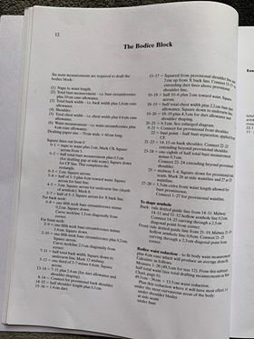

# Language Rules
*For more info in the general goals see [README](README.md).*

## Plan

### Commenting

// is used to comment out the rest of the line just like in JavaScript.

### Data Types
There are 7 data types, the first two are for refering to data and are called IDs.

| Name | Data | Constructor |
| ----------- | ----------- | ----------- |
| Index | Non-Negative Int | *Number |
| StringID | String | *String |
| Length/Angle | Float | Number |
| Point | Pair of FLoats | ( ) |
| Vector | Pair of Floats | < > |
| Line | Pair of Points | [ ] |
| Guide | Origin and angle | { } |

All data is stored in one of 5 lists containing ID, Data pairs.
the Measures list contains the measurments input to the program.
Output lists are output by the program to go on to be rendered.

Lists:
| Name | ID | Data Value | Input | Output |
| ----------- | ----------- | ----------- | ----------- | ----------- |
| Measures | StringID | Length | y | n |
| Vars | StringID | Any Data Type (Except IDs) | n | n |
| Points | Index | Point | n | y |
| Lines | StringID | Line | n | y |
| Guides | STringID | Guide | n | y |

### Functions

#### Get and Set

The Get function '\*' is the only function that can read from the lists. It returns the item from the list to it's left with the ID to it's right: List\*ID   
This is also how you construct IDs as this is the only context they exist in
When used after the set function the get function instead represents the 'location' ID in List.

The Set function '=>' is the only function that can write to the lists. It is preceded by data and followed by a 'location' reference as explained above. Data => List\*ID
Every line ends with a set statement.

#### Constructors

With the exception of ID's Lengths and Angles who's construction has already been explained Data is constructed within a set of brackets. 
*The following is the bare minimum constructors to be expanded on*

-  (Length,Length)
- Vector (Point,Angle)
- Line (Point,Point)
- Guide (Vector) 

*Guide may be redundant... an output and non output list for these vector types is still a good idea though*

## Example Code
*Out of Date*

*"///////Something//////// comments denote what part of the reference instructions this part of code represents*
```
/////////Bodice Block//////////
////////Measurements Layed Out//////////
{
    NW, // Naip to waist
    BUST,
    BACK,
    SHOULDER,
    CHEST,
    WAIST,
    NBC // Neck base circumference
}
/////////Square lines out from 0///////
(0) => *0;
(WAIST+2).90 => *1;
[*0,*1] => ;
(*BUST/2+.5) => *2;
[*0,*2] => ;
*2:*1 => Vars*corner;
[*1,Vars*corner] => ;
[*2, Vars*corner] => *cf;
(2).90 => *3; square once we have 8
*3:(*3:*1)/2+4 => *4;
[*4,([*4,*4:(1)]|Vars*cf)] =>; // Squaring off at angle
                            Consider making function
*4:(3).270 => *5;
([*5,*5:(1)]|Vars*cf) => *6;
[*5,*6] => ;// Squaring off at angle
*5:(*5->*3)/2 => *7;
///////For back neck///////////
*NBC/5-.16 => *8;
([*3,*3:(1)]|[*8,*8:(1).90]) => Vars*temp; // Squaring off at angle
[*3,temp] => ;
[*8,temp] => ;
////////For front neck/////////

TODO: continue
```

### Reference Page

